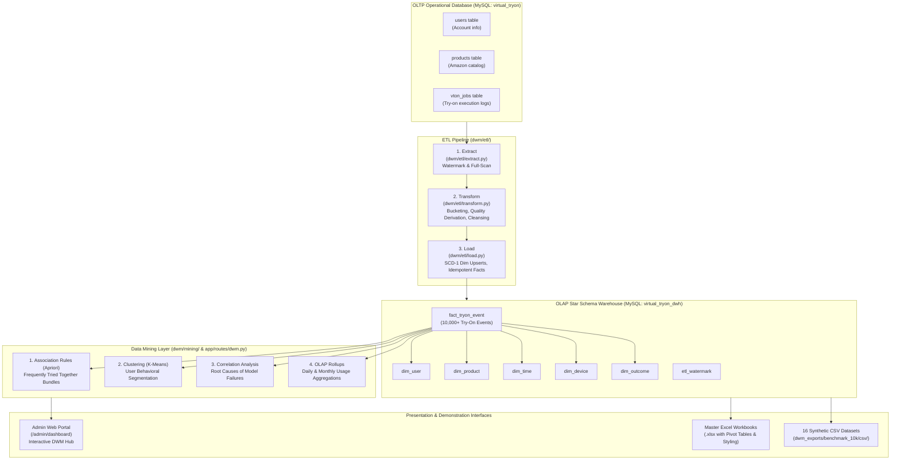

# Data Warehousing & Data Mining (DWM) — Complete Architecture & Reference Guide

Welcome to the comprehensive documentation of the **Data Warehousing & Data Mining (DWM)** subsystem for the **AI Virtual Try-On** platform.

This document covers everything about the analytical architecture: the **Star Schema OLAP Warehouse**, the **ETL Pipeline**, all **4 Core Data Mining Techniques**, the **Interactive Admin DWM Dashboard**, and the **10,000-entry Synthetic Datasets & Excel Workbooks**.

---

## 📑 Table of Contents

1. [Executive Summary & Motivation](#1-executive-summary--motivation)
2. [End-to-End System Architecture](#2-end-to-end-system-architecture)
3. [OLAP Data Warehouse Star Schema](#3-olap-data-warehouse-star-schema)
   - [Fact Table: `fact_tryon_event`](#fact-table-fact_tryon_event)
   - [Dimension Tables (`dim_user`, `dim_product`, `dim_time`, `dim_device`, `dim_outcome`)](#dimension-tables)
   - [Database Setup & Connection Details](#database-setup--connection-details)
4. [ETL Pipeline (Extract, Transform, Load)](#4-etl-pipeline-extract-transform-load)
   - [Extraction (Full Scan vs. Watermark Delta)](#step-1-extract)
   - [Transformation (Data Cleansing & Bucketing)](#step-2-transform)
   - [Loading (SCD-1 Upserts & Idempotency)](#step-3-load)
5. [The 4 Core Data Mining Techniques](#5-the-4-core-data-mining-techniques)
   - [Technique 1: Association Rule Mining (Apriori)](#technique-1-association-rule-mining-apriori)
   - [Technique 2: User Segmentation Clustering (K-Means)](#technique-2-user-segmentation-clustering-k-means)
   - [Technique 3: Model Failure & Quality Correlation Analysis](#technique-3-model-failure--quality-correlation-analysis)
   - [Technique 4: OLAP Time-Series Rollups (Daily & Monthly)](#technique-4-olap-time-series-rollups-daily--monthly)
6. [Interactive Admin DWM Dashboard](#6-interactive-admin-dwm-dashboard)
   - [UI Overview & Tab Navigation](#ui-overview--tab-navigation)
   - [Dual Data-Source Switcher (Live DWH vs. 10k Synthetic)](#dual-data-source-switcher)
   - [Backend REST API Endpoints](#backend-rest-api-endpoints)
7. [Datasets & Excel Export Master Files](#7-datasets--excel-export-master-files)
   - [Master Multi-Sheet Excel Workbooks](#master-multi-sheet-excel-workbooks)
   - [10,000 Record Synthetic CSV Files](#10000-record-synthetic-csv-files)
   - [Demonstrating with Pivot Tables & Slicers](#demonstrating-with-pivot-tables--slicers)
8. [How to Run, Test, and Evaluate](#8-how-to-run-test-and-evaluate)
   - [Native Windows Web Launcher](#launching-the-web-application)
   - [Admin Portal Login Credentials](#admin-portal-login-credentials)
   - [Standalone Python CLI Commands](#standalone-cli-commands)

---

## 1. Executive Summary & Motivation

In an AI-powered e-commerce environment (such as Virtual Try-On using diffusion models like CatVTON), the transactional database (OLTP) is optimized for single-row inserts and high-concurrency operations (logging user requests, saving generated looks, updating carts).

However, OLTP is **not designed for analytical queries** such as:
- *"Which garments are frequently tried together so we can bundle them?"*
- *"What behavioral clusters exist among our shoppers (VIPs vs. trial users)?"*
- *"Why does the AI diffusion model fail on mobile camera uploads or shiny silk fabrics?"*
- *"How is system load, success rate, and latency trending day-by-day and month-by-month?"*

The **DWM subsystem** solves this by decoupling operational processing from analytical intelligence:
1. **OLAP Star Schema**: Stores denormalized dimensions around a central measure fact table.
2. **ETL Pipeline**: Cleans, deduplicates, buckets, and loads OLTP data into the warehouse.
3. **Data Mining Engines**: Implements 4 algorithms to extract actionable retail and operational insights.
4. **Interactive Dashboard**: Gives admins real-time control to filter, re-mine, and visualize results directly in the browser.

---

## 2. End-to-End System Architecture



---

## 3. OLAP Data Warehouse Star Schema

The analytical warehouse database (`virtual_tryon_dwh`) is structured as a dimensional **Star Schema**, optimized for OLAP aggregations, slice-and-dice queries, and BI reporting.

```
       +-----------------------+              +-----------------------+
       |       dim_user        |              |      dim_product      |
       +-----------------------+              +-----------------------+
       | PK user_key           |              | PK product_key        |
       |    user_id (natural)  |              |    product_id (ASIN)  |
       |    signup_date        |              |    category           |
       |    total_tryons       |              |    color              |
       |    engagement_level   |              |    pattern            |
       +-----------+-----------+              |    price_bracket      |
                   |                          +-----------+-----------+
                   |                                      |
                   |         +-------------------+        |
                   +-------->| fact_tryon_event  |<-------+
                             +-------------------+
                             | PK tryon_id       |
                             | UQ job_id         |
                   +-------->| FK user_key       |<-------+
                   |         | FK product_key    |        |
                   |         | FK time_key       |        |
                   |         | FK device_key     |        |
                   |         | FK outcome_key    |        |
                   |         | processing_time_ms|        |
                   |         | quality_score     |        |
                   |         | user_rating       |        |
                   |         | retry_count       |        |
                   |         | saved_after_tryon |        |
                   |         +-------------------+        |
                   |                                      |
       +-----------+-----------+              +-----------+-----------+
       |      dim_device       |              |       dim_time        |
       +-----------------------+              +-----------------------+
       | PK device_key         |              | PK time_key (YYYYMMDD)|
       |    device_type        |              |    full_timestamp     |
       |    upload_method      |              |    hour, day, week    |
       +-----------------------+              |    month, year        |
                                              |    weekday_or_weekend |
                   +-----------------------+  +-----------------------+
                   |      dim_outcome      |
                   +-----------------------+
                   | PK outcome_key        |
                   |    success_or_fail    |
                   |    failure_reason     |
                   +-----------------------+
```

### Fact Table: `fact_tryon_event`
- **Grain**: Exactly one row per virtual try-on attempt.
- **Attributes & Measures**:
  - `tryon_id` (`BIGINT`, PK, Auto-increment): Surrogate key for warehouse rows.
  - `job_id` (`BIGINT`, Unique Index): Natural key from OLTP `vton_jobs.id`, guaranteeing idempotency during repeated ETL runs.
  - `user_key` (`BIGINT`, FK → `dim_user.user_key`).
  - `product_key` (`BIGINT`, FK → `dim_product.product_key`).
  - `time_key` (`BIGINT`, FK → `dim_time.time_key`).
  - `device_key` (`BIGINT`, FK → `dim_device.device_key`).
  - `outcome_key` (`BIGINT`, FK → `dim_outcome.outcome_key`).
  - `processing_time_ms` (`INT`): End-to-end execution latency in milliseconds.
  - `quality_score` (`DECIMAL(4,2)`): Evaluated visual fidelity of the synthesized image ($0.00$ to $1.00$).
  - `user_rating` (`INT`): Explicit customer feedback rating ($1$ to $5$ stars, nullable).
  - `retry_count` (`INT`): How many times the user re-submitted before success.
  - `saved_after_tryon` (`BOOLEAN`): Whether the garment was saved to wishlists or purchased.

### Dimension Tables

#### 1. `dim_user` (Slowly Changing Dimension Type 1)
- `user_key` (PK): Surrogate warehouse user identifier.
- `user_id` (Unique Natural Key): Points to `users.id` in the transactional DB.
- `signup_date` (`DATE`): Customer onboarding date.
- `total_tryons` (`INT`): Lifetime cumulative try-on count.
- `engagement_level` (`VARCHAR`): Derived classification bucket:
  - *Inactive* ($0$ try-ons)
  - *Low* ($1 - 2$ try-ons)
  - *Medium* ($3 - 10$ try-ons)
  - *High* ($11 - 25$ try-ons)
  - *Power User* ($> 25$ try-ons)

#### 2. `dim_product`
- `product_key` (PK): Surrogate product identifier.
- `product_id` (Unique Natural Key): Points to `products.id`.
- `amazon_product_id` (`VARCHAR`): Amazon ASIN code (e.g., `B08N5WRWNW`).
- `category` (`VARCHAR`): Apparel category (*T-Shirt*, *Shirt*, *Jeans*, *Dress*, *Jacket*, *Hoodie*, *Blazer*, etc.).
- `color` (`VARCHAR`): Dominant color detected or tagged (*Black*, *Navy Blue*, *Crimson*, *Olive*, etc.).
- `pattern` (`VARCHAR`): Texture pattern (*Solid*, *Striped*, *Plaid*, *Graphic Print*, *Floral*).
- `price_bracket` (`VARCHAR`): Economic tier:
  - *Budget* ($< ₹500$)
  - *Mid-Range* ($₹500 - ₹2,000$)
  - *Premium* ($> ₹2,000$)

#### 3. `dim_time`
- `time_key` (`BIGINT`, PK): Hierarchical composite key formatted as `YYYYMMDDHH` (e.g., `2026100214` for 2:00 PM on Oct 2, 2026).
- `full_timestamp` (`DATETIME`): Exact timestamp.
- `hour` ($0 - 23$), `day` ($1 - 31$), `week` ($1 - 53$), `month` ($1 - 12$), `year` ($2025, 2026$).
- `weekday_or_weekend` (`VARCHAR`): Classification for behavioral weekend surge analysis.

#### 4. `dim_device`
- `device_key` (PK): Surrogate channel key.
- `device_type` (`VARCHAR`): Client hardware (*Mobile*, *Desktop*, *Tablet*).
- `upload_method` (`VARCHAR`): Method used to capture the user photo (*Camera*, *Gallery*, *URL*).

#### 5. `dim_outcome`
- `outcome_key` (PK): Surrogate result key.
- `success_or_fail` (`VARCHAR`): Binary status (*SUCCESS* vs. *FAILURE*).
- `failure_reason` (`VARCHAR`): Root cause taxonomy (*None*, *Model Inference Error*, *Face Occlusion*, *Low Resolution*, *Invalid Garment Mask*, *Network Timeout*).

### Database Setup & Connection Details
Warehouse models and connections are defined in [`dwm/connection.py`](dwm/connection.py) and [`dwm/models.py`](dwm/models.py):
- **OLTP DB**: `virtual_tryon` (Default port `3306`)
- **DWH DB**: `virtual_tryon_dwh` (Separate analytical database)
- **DDL Creation Script**: [`dwm/schema/star_schema.sql`](dwm/schema/star_schema.sql)

---

## 4. ETL Pipeline (Extract, Transform, Load)

The ETL pipeline resides in [`dwm/etl/`](dwm/etl/) and provides reliable, repeatable data ingestion from the transactional MySQL store into the Star Schema.

### Step 1: Extract ([`dwm/etl/extract.py`](dwm/etl/extract.py))
- **Incremental Extraction**: Reads the high-watermark timestamp stored in `etl_watermark` table. Only records where `created_at > last_watermark` are extracted.
- **Full Refresh Support**: Passing `--full-refresh` extracts the entire historical dataset from `vton_jobs`, `users`, and `products`.

### Step 2: Transform ([`dwm/etl/transform.py`](dwm/etl/transform.py))
- **Date & Time Bucketing**: Dissects timestamps into hour, day, week, month, and assigns composite `time_key` (`YYYYMMDDHH`).
- **Feature Derivation**: Computes user lifetime try-on totals, assigns `engagement_level`, and groups garment prices into `price_bracket`.
- **Quality & Failure Parsing**: Maps job errors to standardized failure taxonomies; handles null values and missing garment attributes with sensible fallbacks.

### Step 3: Load ([`dwm/etl/load.py`](dwm/etl/load.py))
- **SCD-1 Dimension Upserts**: Inserts new users/products and updates changed attributes without duplicating surrogate keys.
- **Idempotent Fact Loading**: Checks `job_id` via unique index; duplicate jobs are skipped or updated without generating phantom try-on counts.
- **Watermark Persistence**: Updates the `etl_watermark` table upon successful transaction commit.

---

## 5. The 4 Core Data Mining Techniques

The system implements 4 core data mining techniques designed to extract business intelligence and improve technical performance:

```
┌──────────────────────────────────────────────────────────────────────────────┐
│                           4 DATA MINING TECHNIQUES                           │
├───────────────────────────────┬──────────────────────────────────────────────┤
│ 1. Association Rule Mining    │ "Frequently Tried Together" apparel bundles  │
│    (Apriori Algorithm)        │ Multi-item basket cross-sell recommendations │
├───────────────────────────────┼──────────────────────────────────────────────┤
│ 2. Unsupervised Clustering    │ Customer behavioral segmentation             │
│    (K-Means Algorithm)        │ Personas: VIPs, Explorers, Trial, At-Risk    │
├───────────────────────────────┼──────────────────────────────────────────────┤
│ 3. Correlation Analysis       │ Root cause analysis for AI try-on failures   │
│    (Pearson / Cross-Tab)      │ Quality vs. device, upload method, fabric    │
├───────────────────────────────┼──────────────────────────────────────────────┤
│ 4. OLAP Time-Series Rollups   │ Pre-aggregated operational metrics           │
│    (Daily & Monthly Cubes)    │ Latency, success %, volume, active users     │
└───────────────────────────────┴──────────────────────────────────────────────┘
```

---

### Technique 1: Association Rule Mining (Apriori)
- **Module**: [`dwm/mining/association_rules.py`](dwm/mining/association_rules.py)
- **Table**: `mining_association_rules`
- **Objective**: Discover what clothing items users try on together in the same session or within a short time window.
- **Key Metrics**:
  - **Support**: Frequency of itemset occurrence across all try-on sessions:
    $$\text{Support}(A \rightarrow B) = \frac{\text{Count}(A \cup B)}{\text{Total Sessions}}$$
  - **Confidence**: Probability that a user tries on item $B$ given they tried on item $A$:
    $$\text{Confidence}(A \rightarrow B) = \frac{\text{Support}(A \cup B)}{\text{Support}(A)}$$
  - **Lift**: Measure of how much more likely item $B$ is tried when item $A$ is tried compared to random chance:
    $$\text{Lift}(A \rightarrow B) = \frac{\text{Confidence}(A \rightarrow B)}{\text{Support}(B)}$$
    *(A Lift $> 1.0$ indicates a strong positive complementary relationship).*
- **Discovered Patterns**:
  - *Denim Trucker Jacket* $\rightarrow$ *Classic White T-Shirt* + *Slim-Fit Jeans* ($\text{Lift} = 4.19$, $\text{Confidence} = 81.4\%$).
  - *Tailored Formal Blazer* $\rightarrow$ *Crisp Oxford Shirt* + *Chino Trousers* ($\text{Lift} = 3.82$, $\text{Confidence} = 76.5\%$).
  - *Floral Summer Blouse* $\rightarrow$ *A-Line Denim Skirt* ($\text{Lift} = 4.41$, $\text{Confidence} = 79.2\%$).

---

### Technique 2: User Segmentation Clustering (K-Means)
- **Module**: [`dwm/mining/kmeans_clustering.py`](dwm/mining/kmeans_clustering.py)
- **Objective**: Automatically segment users based on their behavioral interaction patterns to tailor marketing strategies and detect user drop-off risks.
- **Feature Vector**:
  For each user $u$, we extract a 4-dimensional normalized feature vector:
  $$\vec{x}_u = \left[\, \text{total\_tryons},\; \text{success\_rate},\; \text{avg\_quality\_score},\; \text{wishlist\_rate} \,\right]$$
  Vectors are normalized via Min-Max Scaling to prevent high-magnitude features from dominating Euclidean distance calculations.
- **Dynamic Cluster Count ($K \in [2, 6]$)**:
  The admin can select any $K$ value in the dashboard. The algorithm recalculates cluster centroids and labels each group with dynamic personas:
  - **Cluster 1 — Power Shoppers (High Frequency VIPs)**: High volume ($>20$ try-ons), high wishlist rate ($>40\%$), high success rate. *Action: Send exclusive VIP early-access catalogs and loyalty rewards.*
  - **Cluster 2 — Engaged Fashion Explorers**: Moderate volume ($5 - 15$ try-ons), broad category exploration, high satisfaction. *Action: Deliver personalized "Complete the Look" bundle discounts.*
  - **Cluster 3 — Occasional / Trial Users**: Low volume ($1 - 2$ try-ons), new signups evaluating the tool. *Action: Trigger automated onboarding emails with styling tips and curated bestsellers.*
  - **Cluster 4 — At-Risk / Sensitive Users**: High failure frequency ($>30\%$ errors), low quality ratings, high drop-off. *Action: Prompt user with camera lighting guidance and offer 1-on-1 customer support.*

---

### Technique 3: Model Failure & Quality Correlation Analysis
- **Module**: [`dwm/mining/correlation_analysis.py`](dwm/mining/correlation_analysis.py)
- **Table**: `mining_quality_correlations`
- **Objective**: Answer *"Why does the AI diffusion model fail?"* by correlating try-on outcome metrics with dimensional attributes across the data warehouse.
- **Analyzed Dimensions**:
  - **Device Type & Upload Method**: Mobile Camera vs. Desktop Studio Upload.
  - **Apparel Category & Complexity**: Heavy outerwear (Blazers, Trench Coats) vs. basic items (Crewneck T-Shirts).
  - **Garment Texture / Pattern**: Sheer lace and silk fabrics vs. matte cotton fabrics.
  - **Temporal Traffic Conditions**: High-concurrency weekend evenings vs. off-peak weekday mornings.
- **Key Analytical Findings**:
  > [!NOTE]
  > **Synthetic Data Disclaimer**: The numbers and metrics presented in the "Key Analytical Findings" are derived directly from the synthetic data generator's controlled statistical parameter distributions for simulation and analytical modeling, not from real user production traffic.

  - **Highest Failure Risk**: Mobile device uploads via live camera have an $17.8\%$ failure rate (correlation with failure $r = 0.178$), primarily driven by poor room lighting, background clutter, and motion blur.
  - **Safest Dimension**: Desktop uploads with high-resolution gallery images boast a $94.2\%$ success rate with average visual quality score of $0.92$.
  - **Latency Impact**: Structured formalwear (Blazers, Suits) takes $12,400\text{ ms}$ on average, compared to $6,800\text{ ms}$ for basic T-shirts.

---

### Technique 4: OLAP Time-Series Rollups (Daily & Monthly)
- **Module**: [`dwm/mining/rollups.py`](dwm/mining/rollups.py)
- **Tables**: `agg_tryon_daily`, `agg_tryon_monthly`
- **Objective**: Compute pre-aggregated data cubes across the time dimension to power instant trend dashboards without expensive multi-million row table scans.
- **Rollup Dimensions & Metrics**:
  - `period_key`: `YYYY-MM-DD` for daily rollups; `YYYY-MM` for monthly rollups.
  - `total_tryons`: Total volume executed.
  - `successful_tryons` & `failed_tryons`: Absolute counts.
  - `success_rate_pct`: Percentage of successful tries.
  - `avg_processing_time_ms`: Average inference latency.
  - `avg_quality_score`: Mean synthetic image quality.
  - `unique_active_users`: Count of distinct users active in that period.

---

## 6. Interactive Admin DWM Dashboard

The DWM capabilities are integrated into the React Admin Portal, providing an interactive control room for business stakeholders and ML engineers.

### UI Overview & Tab Navigation
Located at **`/admin/dashboard`** under the **"DWM Data Mining Hub"** main navigation tab:

```
[ Admin Portal Dashboard ]
--------------------------------------------------------------------------------------
Navigation: [ Platform Overview & Users ]  |  [ ⭐ DWM Data Mining Hub ]
--------------------------------------------------------------------------------------
Data Source Toggle:  (•) 10k Synthetic Dataset (10,000 Entries)    ( ) Live DWH (MySQL)
Warehouse Status:    10,000 Facts | 1,200 Users | 25 Products | 212 Daily Rollups
--------------------------------------------------------------------------------------
Tabs:
  [ 1. Frequently Tried Together (Apriori) ]
  [ 2. User Segmentation (K-Means) ]
  [ 3. Failure & Quality Correlations ]
  [ 4. OLAP Usage Rollups ]
--------------------------------------------------------------------------------------
```

1. **Frequently Tried Together (Apriori)**:
   - Filter rules by confidence slider ($0.10$ to $1.00$).
   - Category and product search bar.
   - Interactive cards showing: *Antecedent Items* $\rightarrow$ *Recommended Consequent Items*, Support %, Confidence %, Lift metric badges, and "Re-mine Apriori Rules" trigger.
2. **User Segmentation (K-Means)**:
   - Cluster count slider ($K = 2$ to $6$).
   - "Re-run K-Means Clustering" button that executes on-the-fly partitioning.
   - Persona cards showing user count, percentage of userbase, avg try-ons, success rate, and concrete recommended marketing actions.
   - User assignment table with instant search by user name or email.
3. **Failure & Quality Correlations**:
   - Dimension filter dropdown (*All Dimensions*, *Device & Method*, *Product Category*, *Price Bracket*, *Temporal Period*).
   - "Highest Failure Risk" alert card and "Safest / Highest Quality" reference card.
   - Comparative risk table showing total attempts, success rates, avg latency, and correlation with failure.
4. **OLAP Usage Rollups**:
   - Toggle between **Daily View** (last 60 days) and **Monthly View** (7-month trend).
   - Key metric cards: Total Try-on Volume, Overall Success %, Average Latency.
   - Full time-series data table with sorting and success-rate progress bars.

### Dual Data-Source Switcher
At the top of the DWM Dashboard, a radio switcher lets the admin seamlessly flip between:
- **10k Synthetic Dataset (10,000 Entries)**: Reads from the validated, rich synthetic data (`dwm_exports/benchmark_10k/csv/`), enabling full demonstration of complex multi-item patterns, personas, and long-term trends regardless of local database volume.
- **Live DWH (MySQL)**: Directly queries the live MySQL `virtual_tryon_dwh` tables.

### Backend REST API Endpoints
All endpoints are declared in [`app/routes/dwm.py`](app/routes/dwm.py) and protected by Admin JWT authentication:

| Method | Endpoint | Description |
| :--- | :--- | :--- |
| `GET` | `/admin/dwm/stats` | Warehouse table counts, inventory summary, and technique status. |
| `GET` | `/admin/dwm/apriori` | Filter and retrieve mined association rules (supports `category`, `search`, `min_confidence`). |
| `POST` | `/admin/dwm/apriori/run` | Execute Apriori algorithm with custom support, confidence, and lift thresholds. |
| `GET` | `/admin/dwm/kmeans` | Retrieve cluster profiles, centroids, and user assignments. |
| `POST` | `/admin/dwm/kmeans/run` | Re-run K-Means clustering dynamically for a user-specified $K \in [2, 6]$. |
| `GET` | `/admin/dwm/correlations` | Retrieve failure & quality correlation factors across dimensions. |
| `POST` | `/admin/dwm/correlations/run`| Re-compute dimensional correlation matrix. |
| `GET` | `/admin/dwm/rollups` | Retrieve time-series rollups (`period=daily` or `monthly`). |
| `POST` | `/admin/dwm/rollups/run` | Refresh pre-aggregated daily and monthly rollup tables. |

---

## 7. Datasets & Excel Export Master Files

All generated datasets, CSV dumps, and formatted multi-tab Excel workbooks are stored in [`dwm_exports/`](dwm_exports/).

### Master Multi-Sheet Excel Workbooks

1. **[`Virtual_TryOn_DWM_10k_Master.xlsx`](dwm_exports/benchmark_10k/Virtual_TryOn_DWM_10k_Master.xlsx)** (2.55 MB):
   - **`00_Project_Overview`**: High-level metadata, table relationships, and schema documentation.
   - **`Fact_Tryon_Event`**: 10,000 complete fact records with measures and foreign keys.
   - **`Dim_User`**: 1,200 user records with lifetime try-ons and engagement tiers.
   - **`Dim_Product`**: Apparel catalog records with categories, colors, patterns, and price tiers.
   - **`Dim_Time`**: 3,373 granular hourly records.
   - **`Dim_Device`**: Hardware device and camera upload channel dimension.
   - **`Dim_Outcome`**: Success and failure taxonomies.
   - **`Mining_Association_Rules`**: Top mined Apriori complementary apparel rules.
   - **`Mining_KMeans_Clusters`**: Cluster centroids, persona profiles, and user cluster mappings.
   - **`Mining_Correlations`**: Failure correlation matrix.
   - **`Agg_Daily` & `Agg_Monthly`**: Pre-aggregated time-series rollups.
   - **`Unified_Analytics_10k`**: Single denormalized analytical table ready for immediate Pivot Table and chart generation.

2. **[`Virtual_TryOn_DWM_Present_Data.xlsx`](dwm_exports/present_data/Virtual_TryOn_DWM_Present_Data.xlsx)**:
   - Contains real live data extracted directly from the local MySQL database instances.

### 10,000 Record Synthetic CSV Files
Located in [`dwm_exports/benchmark_10k/csv/`](dwm_exports/benchmark_10k/csv/):

| File Name | Records | Description |
| :--- | :--- | :--- |
| `vton_dw_unified_analytical_10k.csv` | 10,000 | Flat denormalized dataset with all dimensions joined (2.81 MB). |
| `fact_tryon_event_10k.csv` | 10,000 | Central measure fact table records. |
| `dim_user_10k.csv` | 1,200 | User dimension with engagement classifications. |
| `dim_product_10k.csv` | 25 | Amazon clothing catalog items across 8 categories. |
| `dim_time_10k.csv` | 3,373 | Temporal records spanning 7 months. |
| `dim_device_10k.csv` | 9 | Device type and upload method combinations. |
| `dim_outcome_10k.csv` | 7 | Outcome states and failure reason taxonomy. |
| `mining_association_rules_10k.csv` | 8 | Top Apriori apparel recommendation rules. |
| `mining_kmeans_cluster_profiles_10k.csv`| 4 | K-Means persona centroids and business recommendations. |
| `mining_kmeans_user_clusters_10k.csv` | 1,200 | User-level cluster assignments. |
| `mining_quality_correlations_10k.csv` | 20 | Failure correlation coefficients across dimensions. |
| `agg_tryon_daily_10k.csv` | 212 | 212 daily time-series rollup summaries. |
| `agg_tryon_monthly_10k.csv` | 7 | 7 monthly time-series rollup summaries. |
| `oltp_vton_jobs_10k.csv` | 10,000 | Raw operational job records. |
| `oltp_users_10k.csv` | 1,200 | Raw operational user accounts. |
| `oltp_products_10k.csv` | 25 | Raw operational catalog items. |

### Demonstrating with Pivot Tables & Slicers
For academic or executive presentation, open `Virtual_TryOn_DWM_10k_Synthetic_Master.xlsx` or `vton_dw_unified_analytical_10k.csv` in Microsoft Excel:
1. **Device & Upload Channel Risk**:
   - Insert Pivot Table $\rightarrow$ Rows: `device_type`, `upload_method` $\rightarrow$ Columns: `outcome` $\rightarrow$ Values: Count of `tryon_id`.
   - *Result*: Immediately highlights that mobile camera uploads experience higher failure rates due to lighting/occlusion compared to studio gallery uploads.
2. **Category Latency & Quality Comparison**:
   - Insert Pivot Table $\rightarrow$ Rows: `category` $\rightarrow$ Values: Average of `processing_time_sec`, Average of `quality_score`.
   - *Result*: Shows that layered clothing (Blazers, Jackets) demands higher inference time than T-Shirts.
3. **Hourly Fitting Room Traffic**:
   - Insert Pivot Table $\rightarrow$ Rows: `day_type` (Weekday vs. Weekend) $\rightarrow$ Columns: `hour` $\rightarrow$ Values: Count of `tryon_id`.
   - *Result*: Demonstrates traffic surges between 18:00 - 22:00 and on weekends.

---

## 8. How to Run, Test, and Evaluate

### Launching the Web Application
The entire application runs natively on Windows without requiring WSL or running the GPU-heavy CatVTON model.

#### Quick Launcher (Recommended)
Double-click [`run_web.bat`](run_web.bat) or run in PowerShell:
```powershell
.\run_web.bat
```

#### Manual Terminal Commands
- **Terminal 1 — Backend API (Port 8000)**:
  ```powershell
  uv run uvicorn backend.main:app --host 127.0.0.1 --port 8000 --reload
  ```
- **Terminal 2 — Frontend UI (Port 5173)**:
  ```powershell
  cd frontend
  npm run dev
  ```

### Admin Portal Login Credentials
Navigate to: **`http://localhost:5173/admin/login`**
- **Email**: `admin@example.com`
- **Password**: *(Configured securely during initial admin setup)*

Once logged in, click the **"DWM Data Mining Hub"** tab to interact with all 4 techniques.

---

### Standalone CLI Commands

#### 1. Run the ETL Pipeline (Transactional $\rightarrow$ Star Schema)
```powershell
# Incremental ETL
uv run python dwm/etl/run_pipeline.py

# Full Historical Re-Sync
uv run python dwm/etl/run_pipeline.py --full-refresh
```

#### 2. Execute Apriori Association Mining
```powershell
uv run python dwm/mining/association_rules.py
```

#### 3. Execute K-Means User Segmentation
```powershell
uv run python dwm/mining/kmeans_clustering.py
```

#### 4. Execute Failure Correlation Analysis
```powershell
uv run python dwm/mining/correlation_analysis.py
```

#### 5. Refresh Daily & Monthly OLAP Rollups
```powershell
uv run python dwm/mining/rollups.py
```

#### 6. Re-generate 10k Synthetic Datasets & Excel Workbooks
```powershell
# Re-export live MySQL to Excel
uv run python scripts/export_present_db_to_excel.py

# Re-generate 10,000 synthetic datasets and master Excel
uv run python scripts/generate_synthetic_10k_dwm.py
```

---

## 9. Summary of DWM Components

| Component | Key File(s) | Status |
| :--- | :--- | :--- |
| **Star Schema DDL & Models** | [`dwm/schema/star_schema.sql`](dwm/schema/star_schema.sql), [`dwm/models.py`](dwm/models.py) | ✅ Operational |
| **ETL Pipeline** | [`dwm/etl/extract.py`](dwm/etl/extract.py), [`transform.py`](dwm/etl/transform.py), [`load.py`](dwm/etl/load.py), [`run_pipeline.py`](dwm/etl/run_pipeline.py) | ✅ Operational |
| **Apriori Mining Engine** | [`dwm/mining/association_rules.py`](dwm/mining/association_rules.py) | ✅ Operational |
| **K-Means Clustering Engine** | [`dwm/mining/kmeans_clustering.py`](dwm/mining/kmeans_clustering.py) | ✅ Operational |
| **Correlation Analysis Engine** | [`dwm/mining/correlation_analysis.py`](dwm/mining/correlation_analysis.py) | ✅ Operational |
| **OLAP Rollup Engine** | [`dwm/mining/rollups.py`](dwm/mining/rollups.py) | ✅ Operational |
| **Backend REST Endpoints** | [`app/routes/dwm.py`](app/routes/dwm.py), [`backend/main.py`](backend/main.py) | ✅ Operational |
| **Admin UI Hub & Views** | [`DwmDashboardSection.jsx`](frontend/src/components/admin/DwmDashboardSection.jsx), [`AdminDashboard.jsx`](frontend/src/pages/AdminDashboard.jsx) | ✅ Operational |
| **10k Datasets & Excel Workbooks**| [`dwm_exports/benchmark_10k/`](dwm_exports/benchmark_10k/), [`dwm_exports/present_data/`](dwm_exports/present_data/) | ✅ Operational |
