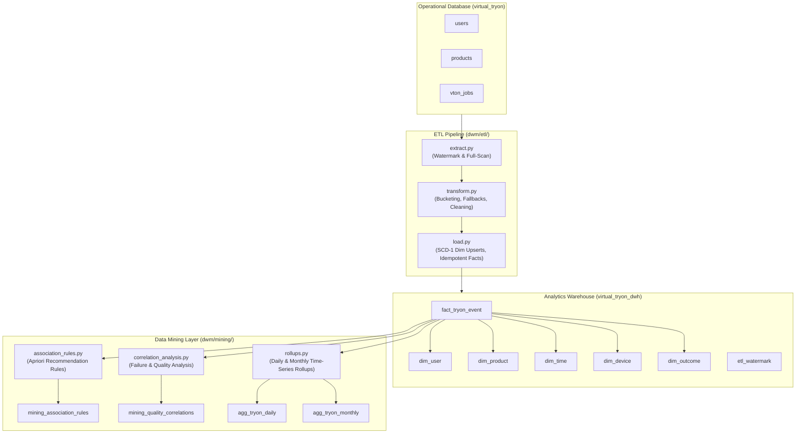

# Data Warehouse & Data Mining (DWM) — Virtual Try-On Analytics

This module implements the **OLAP Data Warehouse (Star Schema)**, the **ETL Pipeline**, and the **Data Mining Layer** for the AI Virtual Try-On platform. It operates as an independent analytical service reading from the operational OLTP database (`virtual_tryon`) and loading into a dedicated analytical warehouse database (`virtual_tryon_dwh`).

> **Note on Scope**: Per architectural design specifications, user clustering / K-Means has been explicitly excluded from this module.

---

## 1. Architecture Overview



---

## 2. Directory Structure

```text
dwm/
├── __init__.py                  # DWM root package
├── connection.py                # Dual OLTP + DWH engine management & schema initializers
├── models.py                    # SQLAlchemy ORM models for DWH star schema & mining tables
├── README.md                    # This documentation file
├── schema/
│   ├── __init__.py
│   └── star_schema.sql          # Native MySQL DDL for warehouse, dims, facts, and mining tables
├── etl/
│   ├── __init__.py              # ETL package exports
│   ├── extract.py               # Full and incremental OLTP extraction with watermark tracking
│   ├── transform.py             # Data cleansing, time bucketing, category derivation, fallbacks
│   ├── load.py                  # Dimension upserts (SCD-1) and idempotent fact loading
│   └── run_pipeline.py          # Unified CLI orchestration entrypoint
└── mining/
    ├── __init__.py              # Data mining package exports
    ├── association_rules.py     # Pure-Python Apriori algorithm discovering co-tried products
    ├── correlation_analysis.py  # Model failure / quality correlation across dimensions
    └── rollups.py               # Daily and monthly pre-aggregated OLAP time-series rollups
```

---

## 3. Star Schema Specification

### Fact Table: `fact_tryon_event`
- **Grain**: One record per virtual try-on execution.
- **Columns**:
  - `tryon_id` (`BIGINT`, PK, Auto-increment): Surrogate key.
  - `job_id` (`BIGINT`, Unique Index): Natural OLTP `vton_jobs.id` ensuring idempotency.
  - `user_key` (`BIGINT`, FK → `dim_user.user_key`).
  - `product_key` (`BIGINT`, FK → `dim_product.product_key`).
  - `time_key` (`BIGINT`, FK → `dim_time.time_key`).
  - `device_key` (`BIGINT`, FK → `dim_device.device_key`).
  - `outcome_key` (`BIGINT`, FK → `dim_outcome.outcome_key`).
  - `processing_time_ms` (`INT`): Total latency in milliseconds.
  - `quality_score` (`DECIMAL(4,2)`): Model synthetic output quality metric.
  - `user_rating` (`INT`): Explicit customer rating (1-5), if given.
  - `retry_count` (`INT`): Number of attempts before completion.
  - `saved_after_tryon` (`BOOLEAN`): Whether customer wishlisted/saved look.

### Dimension Tables
1. **`dim_user`**:
   - `user_key` (PK), `user_id` (Natural Key, Unique), `signup_date`, `total_tryons`, `engagement_level` ("Inactive", "Low (1-2)", "Medium (3-10)", "High (11-25)", "Power User (>25)").
2. **`dim_product`**:
   - `product_key` (PK), `product_id` (Natural Key, Unique), `amazon_product_id` (ASIN), `category`, `color`, `pattern`, `price_bracket` ("Budget (<500)", "Mid-Range (500-2000)", "Premium (>2000)").
3. **`dim_time`**:
   - `time_key` (PK, e.g. `YYYYMMDDHH`), `full_timestamp`, `hour`, `day`, `week`, `month`, `year`, `weekday_or_weekend`.
4. **`dim_device`**:
   - `device_key` (PK), `device_type` ("Mobile", "Desktop", "Tablet"), `upload_method` ("Camera", "Gallery", "URL").
5. **`dim_outcome`**:
   - `outcome_key` (PK), `success_or_fail` ("SUCCESS", "FAILURE"), `failure_reason` ("None", "Model Inference Error", etc.).

### Mining & Rollup Tables
- **`mining_association_rules`**: Stores antecedents, consequents, support, confidence, and lift from Apriori.
- **`mining_quality_correlations`**: Correlation coefficients between dimension attributes and failure rates.
- **`agg_tryon_daily`**: Daily rollups (`total_tryons`, `successful_tryons`, `failed_tryons`, `avg_processing_time_ms`, `avg_quality_score`, `unique_active_users`).
- **`agg_tryon_monthly`**: Monthly rollups keyed by `YYYY-MM`.
- **`etl_watermark`**: High-watermark tracking for incremental ETL jobs.

---

## 4. How to Run the Pipeline & Mining Jobs

Make sure the virtual environment is activated:
```powershell
# Windows
.\venv\Scripts\Activate.ps1

# Linux / macOS
source venv/bin/activate
```

### Step 1: (Optional) Seed Synthetic Demo Data in OLTP
If starting with an empty database, seed realistic users, products, and try-on jobs:
```bash
python scripts/seed_demo_data.py
```

### Step 2: Initialize DWH & Run the ETL Pipeline
Run incremental ETL (reads only new jobs since the last watermark):
```bash
python dwm/etl/run_pipeline.py
```

To force a full historical re-extraction:
```bash
python dwm/etl/run_pipeline.py --full-refresh
```

### Step 3: Run Apriori Association Rule Mining
Generates "frequently tried together" product recommendation rules:
```bash
python dwm/mining/association_rules.py
```
*Results are written to `virtual_tryon_dwh.mining_association_rules`.*

### Step 4: Run Failure Correlation Analysis
Analyzes why the model fails across devices, categories, price brackets, and time:
```bash
python dwm/mining/correlation_analysis.py
```
*Results are written to `virtual_tryon_dwh.mining_quality_correlations`.*

### Step 5: Refresh OLAP Time-Series Rollups
Pre-computes daily and monthly usage summaries for executive and admin dashboards:
```bash
python dwm/mining/rollups.py
```
*Results are written to `virtual_tryon_dwh.agg_tryon_daily` and `agg_tryon_monthly`.*

---

## 5. Automation & Scheduling (Cron / Celery)

The pipeline and mining jobs are structured as pure Python entrypoints and can easily be automated:

```python
from dwm.etl import run_etl_pipeline
from dwm.mining import (
    generate_and_save_association_rules,
    generate_and_save_correlations,
    refresh_all_rollups
)

def nightly_analytics_job():
    # 1. Sync latest operational data
    run_etl_pipeline(full_refresh=False)
    # 2. Update rollups
    refresh_all_rollups()
    # 3. Recompute mining models
    generate_and_save_association_rules(min_support=0.05, min_confidence=0.2, min_lift=1.0)
    generate_and_save_correlations()
```

---

## 6. Upstream Dependencies & Field Gaps to Communicate to Teammates

For the analytics warehouse to transition from proxy fallbacks to true production telemetry, the following items must be provided upstream:

1. **`vton_jobs` Table Extensions**:
   - `quality_score`: Upstream AI inference engine (`ankush-model`) needs to write the visual quality metric (e.g. SSIM / LPIPS / FID proxy score).
   - `user_rating`: Frontend customer feedback modal rating (1-5 stars) needs an API endpoint to record into `vton_jobs`.
   - `retry_count`: Track execution retry attempts per job.
   - `device_type` & `upload_method`: Capture client metadata (`Mobile`/`Desktop`, `Camera`/`Gallery`) at try-on initiation.
   - `failure_reason`: When status is `FAILED`, record the specific failure reason (e.g. `Face Occlusion`, `Pose Distortion`, `CUDA Out of Memory`, `Timeout`).
2. **Product Taxonomy (`products` table)**:
   - Provide `color` and `pattern` as explicit database fields rather than deriving them from title heuristics.
3. **Persisted Wishlist / Saved Looks**:
   - The "saved after try-on" signal is currently stored in client-side `localStorage` on frontend branches (`rakshita-frontend`). An API endpoint is needed to persist saved looks to MySQL so ETL can populate `saved_after_tryon`.
