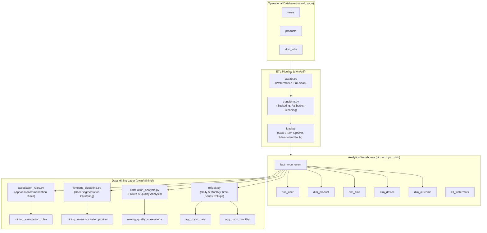

# Data Warehouse & Data Mining (DWM) — Virtual Try-On Analytics

This module implements the **OLAP Data Warehouse (Star Schema)**, the **ETL Pipeline**, and the **Data Mining Layer** for the AI Virtual Try-On platform. It operates as an independent analytical service reading from the operational OLTP database (`virtual_tryon`) and loading into a dedicated analytical warehouse database (`virtual_tryon_dwh`).

For the complete, extensive project guide with Excel datasets and dashboard integration, refer to [DWM_README.md](../DWM_README.md).

---

## 1. Architecture Overview


```mermaid
graph TD
    subgraph OLTP ["Operational Database (virtual_tryon)"]
        Users["users"]
        Products["products"]
        Jobs["vton_jobs"]
    end

    subgraph ETL ["ETL Pipeline (dwm/etl/)"]
        Extract["extract.py\n(Watermark & Full-Scan)"]
        Transform["transform.py\n(Bucketing, Fallbacks, Cleaning)"]
        Load["load.py\n(SCD-1 Dim Upserts, Idempotent Facts)"]
        Extract --> Transform --> Load
    end

    subgraph DWH ["Analytics Warehouse (virtual_tryon_dwh)"]
        Fact["fact_tryon_event"]
        DimU["dim_user"]
        DimP["dim_product"]
        DimT["dim_time"]
        DimD["dim_device"]
        DimO["dim_outcome"]
        Watermark["etl_watermark"]

        Fact --> DimU
        Fact --> DimP
        Fact --> DimT
        Fact --> DimD
        Fact --> DimO
    end

    subgraph Mining ["Data Mining Layer (dwm/mining/)"]
        Apriori["association_rules.py\n(Apriori Recommendation Rules)"]
        KMeans["kmeans_clustering.py\n(User Segmentation Clustering)"]
        Correlation["correlation_analysis.py\n(Failure & Quality Analysis)"]
        Rollups["rollups.py\n(Daily & Monthly Time-Series Rollups)"]

        Fact --> Apriori
        Fact --> KMeans
        Fact --> Correlation
        Fact --> Rollups
        
        RulesTable["mining_association_rules"]
        ProfilesTable["mining_kmeans_cluster_profiles"]
        CorrTable["mining_quality_correlations"]
        DailyTable["agg_tryon_daily"]
        MonthlyTable["agg_tryon_monthly"]

        Apriori --> RulesTable
        KMeans --> ProfilesTable
        Correlation --> CorrTable
        Rollups --> DailyTable
        Rollups --> MonthlyTable
    end

    OLTP --> Extract
    Load --> DWH
```

---

## 2. Directory Structure

```text
dwm/
├── __init__.py                  # DWM root package
├── connection.py                # Dual OLTP + DWH engine management & schema initializers
├── models.py                    # SQLAlchemy ORM models for DWH star schema & mining tables
├── README.md                    # This documentation file
├── schema/
│   ├── __init__.py
│   └── star_schema.sql          # Native MySQL DDL for warehouse, dims, facts, and mining tables
├── etl/
│   ├── __init__.py              # ETL package exports
│   ├── extract.py               # Full and incremental OLTP extraction with watermark tracking
│   ├── transform.py             # Data cleansing, time bucketing, category derivation, fallbacks
│   ├── load.py                  # Dimension upserts (SCD-1) and idempotent fact loading
│   └── run_pipeline.py          # Unified CLI orchestration entrypoint
└── mining/
    ├── __init__.py              # Data mining package exports
    ├── association_rules.py     # Pure-Python Apriori algorithm discovering co-tried products
    ├── kmeans_clustering.py     # K-Means user segmentation with dynamic K & persona labelling
    ├── correlation_analysis.py  # Model failure / quality correlation across dimensions
    └── rollups.py               # Daily and monthly pre-aggregated OLAP time-series rollups
```

---

## 3. Star Schema Specification

### Fact Table: `fact_tryon_event`
- **Grain**: One record per virtual try-on execution.
- **Columns**:
  - `tryon_id` (`BIGINT`, PK, Auto-increment): Surrogate key.
  - `job_id` (`BIGINT`, Unique Index): Natural OLTP `vton_jobs.id` ensuring idempotency.
  - `user_key` (`BIGINT`, FK → `dim_user.user_key`).
  - `product_key` (`BIGINT`, FK → `dim_product.product_key`).
  - `time_key` (`BIGINT`, FK → `dim_time.time_key`).
  - `device_key` (`BIGINT`, FK → `dim_device.device_key`).
  - `outcome_key` (`BIGINT`, FK → `dim_outcome.outcome_key`).
  - `processing_time_ms` (`INT`): Total latency in milliseconds.
  - `quality_score` (`DECIMAL(4,2)`): Model synthetic output quality metric ($0.00$ to $1.00$).
  - `user_rating` (`INT`): Explicit customer rating ($1 - 5$), if given.
  - `retry_count` (`INT`): Number of attempts before completion.
  - `saved_after_tryon` (`BOOLEAN`): Whether customer wishlisted/saved look.

### Dimension Tables
1. **`dim_user`**:
   - `user_key` (PK), `user_id` (Natural Key, Unique), `signup_date`, `total_tryons`, `engagement_level` ("Inactive", "Low (1-2)", "Medium (3-10)", "High (11-25)", "Power User (>25)").
2. **`dim_product`**:
   - `product_key` (PK), `product_id` (Natural Key, Unique), `amazon_product_id` (ASIN), `category`, `color`, `pattern`, `price_bracket` ("Budget (<500)", "Mid-Range (500-2000)", "Premium (>2000)").
3. **`dim_time`**:
   - `time_key` (PK, e.g. `YYYYMMDDHH`), `full_timestamp`, `hour`, `day`, `week`, `month`, `year`, `weekday_or_weekend`.
4. **`dim_device`**:
   - `device_key` (PK), `device_type` ("Mobile", "Desktop", "Tablet"), `upload_method` ("Camera", "Gallery", "URL").
5. **`dim_outcome`**:
   - `outcome_key` (PK), `success_or_fail` ("SUCCESS", "FAILURE"), `failure_reason` ("None", "Model Inference Error", etc.).

### Mining & Rollup Tables
- **`mining_association_rules`**: Stores antecedents, consequents, support, confidence, and lift from Apriori.
- **`mining_quality_correlations`**: Correlation coefficients between dimension attributes and failure rates.
- **`agg_tryon_daily`**: Daily rollups (`total_tryons`, `successful_tryons`, `failed_tryons`, `avg_processing_time_ms`, `avg_quality_score`, `unique_active_users`).
- **`agg_tryon_monthly`**: Monthly rollups keyed by `YYYY-MM`.
- **`etl_watermark`**: High-watermark tracking for incremental ETL jobs.

---

## 4. The 4 Data Mining Techniques

1. **Association Rule Mining (Apriori)**:
   - Module: `dwm/mining/association_rules.py`
   - Purpose: Discovers frequently tried-together apparel itemsets for bundling recommendations.
2. **Clustering (K-Means User Segmentation)**:
   - Module: `dwm/mining/kmeans_clustering.py`
   - Purpose: Partitions user base into behavioral personas (*Power Shoppers VIPs*, *Engaged Explorers*, *Occasional Trial*, *At-Risk / Sensitive*) across try-on volume, success rate, quality, and wishlist rate.
3. **Correlation Analysis**:
   - Module: `dwm/mining/correlation_analysis.py`
   - Purpose: Pinpoints root causes of AI model failures across devices, upload methods, fabric types, and peak hours.
4. **OLAP Time-Series Rollups**:
   - Module: `dwm/mining/rollups.py`
   - Purpose: Pre-aggregates daily and monthly analytical summaries for rapid executive dashboards.

---

## 5. How to Run

### Run Standalone Mining & Pipeline Scripts
```powershell
# Run ETL Pipeline
uv run python dwm/etl/run_pipeline.py

# Run Apriori
uv run python dwm/mining/association_rules.py

# Run K-Means Clustering
uv run python dwm/mining/kmeans_clustering.py

# Run Correlation Analysis
uv run python dwm/mining/correlation_analysis.py

# Refresh Rollups
uv run python dwm/mining/rollups.py
```

### Run the Interactive Admin Web Dashboard
Launch the web interface using:
```powershell
.\run_web.bat
```
Navigate to `http://localhost:5173/admin/login` (Login: `admin@example.com` / *(Configured Admin Password)*) and click **"DWM Data Mining Hub"**.
